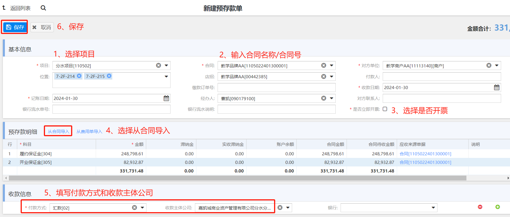
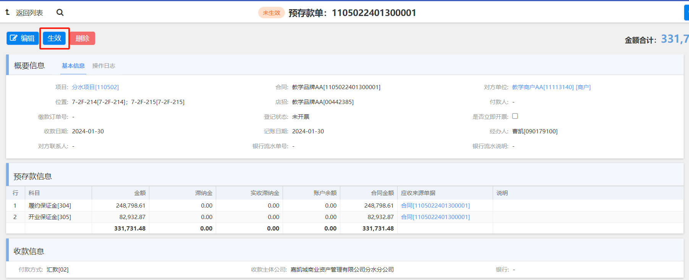
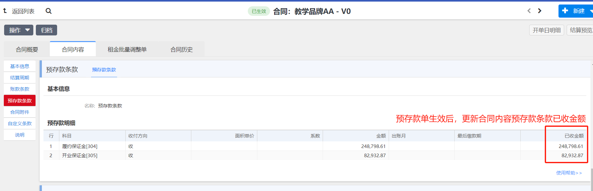
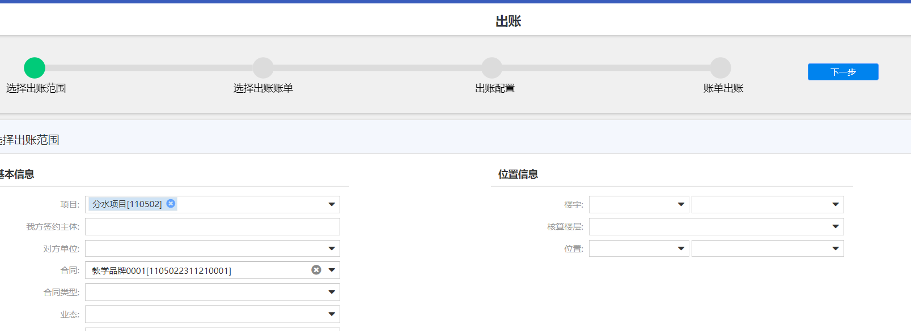
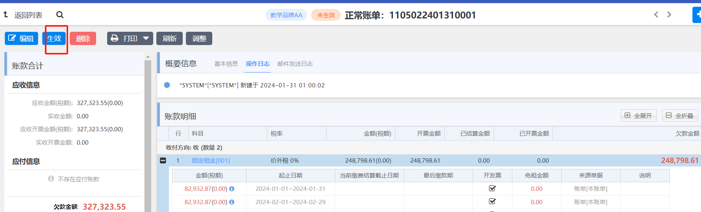
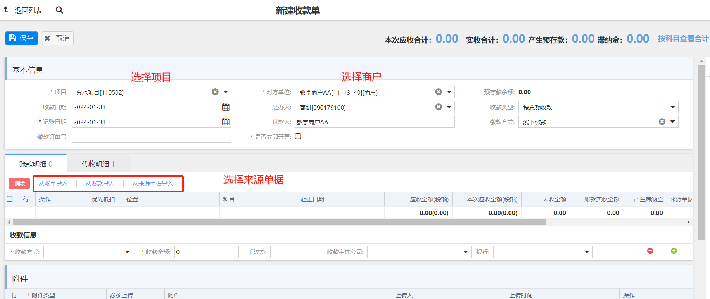
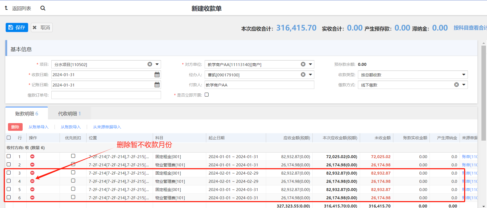
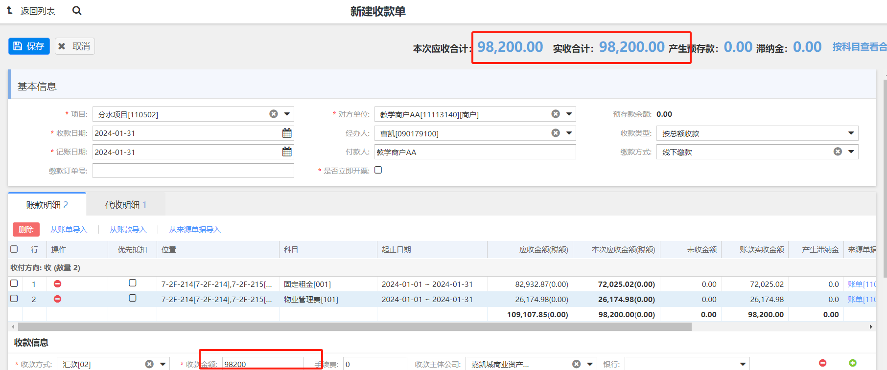
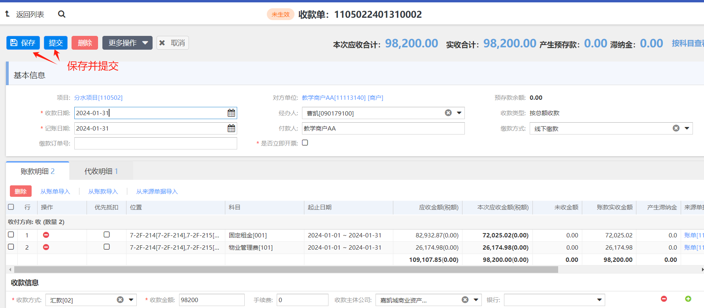

## 🏷️ 预存款单

___

> **账务 >> 收款 >> 预存款单 >> 新建**
> 
> 🔑`权限:项目招商企划人员`
> 
> 
> 
> **账务 >> 收款 >> 预存款单 >> 生效**
> 
> 🔑`权限:项目出纳`
> 
> 
> 
> **预存款单生效后，会自动更新合同中预存款已收金额**
> 
> 
> 
>  **至此，这份合同为有效合同**

## 🏷️ 出账

___

> **合同结算周期里面配置自动/手动出账，自动出账，系统会在约定出账期之后自动生成账单，如果是手动出账，则需要通过 `账务` >> `财务应收` >> `出账` 模块手动产生账单**
> 
> 
> 

## 🏷️ 账单

___

> **自动/手动产生的账单，状态都是 `未生效`，需要进入 `账务` >> `财务应收` >> `账单` 模块，对账单进行生效**
> 
> 🔑`权限:项目运营人员`
> 
> 
> 

## 收款

___

> 账务 >> 收款 >> 收款单 >> 新建 >> 收款流程  
> 
> 🔑 `权限：项目运营人员`
> 
> 
> 
> 
> 
> 
> 
> 