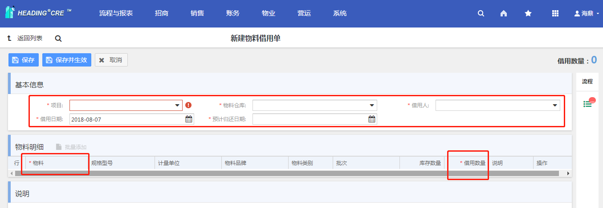
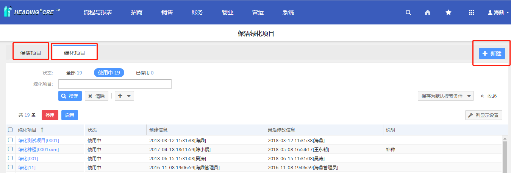
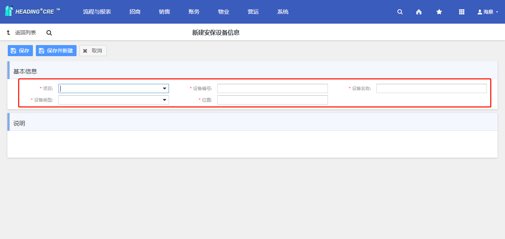
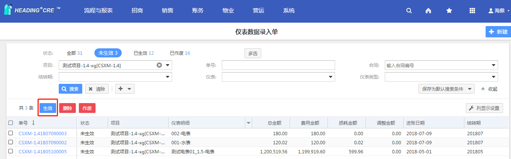

___

# 文档目的

本文目的是介绍HDCRE物业版块的功能点及使用的操作步骤。

# 物业管理综述

销售管理包含了5个主要内容：物料、安保设备、保洁绿化、水电煤、其他，后续会分模块详细介绍。

# 物料

## 物料

**【操作菜单】**

【物业】--【物料】--【物料】

**【操作界面】**

1.  进入【物业】--【物料】--【物料】，新建物料：

2\. 填写基本信息及库存预警内容，点击保存，完成物料的新建。

3\. 保存后，可重新编辑或者删除物料。

**【关联业务说明】**

前置条件：无。后置条件：物料进销存管理。

**【功能操作注意点说明】**

暂无。

**【名词解释】**

略

## 物料品牌

**【操作菜单】**

【物业】--【物料】--【物料品牌】

**【操作界面】**

1、进入【物业】--【物料】--【物料品牌】，新建物料品牌信息：

> 2、填写基本信息：项目、代码、名称，点击保存，完成新建物料品牌：

> 3、对已建立的物料品牌，可右键代码进行编辑和删除操作：

4、对已经删除的物料品牌，可以恢复删除：

**【关联业务说明】**

前置条件：无。后置条件：物料的进销存管理。

**【功能操作注意点说明】**

暂无。

**【名词解释】**

略

## 物料类别

**【操作菜单】**

【物业】--【物料】--【物料类别】

**【操作界面】**

> 1、进入【物业】--【物料】--【物料类别】，新建物料类别：

2、基本信息填写项目、代码（可自动生成，勾选自动生成）、名称、上级类别。点击保存，完成新建物料类别。保存后可编辑、删除。

**【关联业务说明】**

前置条件：无。后置条件：物料的进销存管理。

**【功能操作注意点说明】**

暂无

**【名词解释】**

略

## 物料供应商

**【操作菜单】**

【物业】--【物料】--【物料供应商】

**【操作界面】**

1.  进入【物业】--【物料】--【物料供应商】，新建物料供应商：

2.  基本信息、联系信息进行内容填写，点击保存按钮，完成物料供应商的

> 新建。保存后可编辑、删除。

**【关联业务说明】**

前置条件：无。后置条件：物料采购单。

**【功能操作注意点说明】**

暂无

**【名词解释】**

略

## 物料仓库

**【操作菜单】**

【物业】--【物料】--【物料仓库】

**【操作界面】**

> 1.进入【物业】--【物料】--【物料仓库】，新建物料仓库：

> 2.输入：项目、用户类型、代码、姓名、口令、确认口令，然后保存

**【关联业务说明】**

前置条件：无。后置条件：收银机组。

**【功能操作注意点说明】**

暂无。

**【名词解释】**

略

## 物料申购单

**【操作菜单】**

【物业】--【物料】--【物料申购单】

**【操作界面】**

> 1.进入【物业】--【物料】--【物料申购单】，新建物料申购单：

> 2.输入：项目、申请人、物料、数量，然后保存

3.新建物料申请单后需要进行生效和完成

**【关联业务说明】**

前置条件：无。后置条件：无。

**【功能操作注意点说明】**

暂无。

**【名词解释】**

略

## 物料采购单

**【操作菜单】**

【物业】--【物料】--【物料采购单】

**【操作界面】**

> 1.进入【物业】--【物料】--【物料采购单】，新建物料采购单：

> 2.填写基本信息及采购明细，然后保存并生效

**【关联业务说明】**

前置条件：无。后置条件：采购入库单。

**【功能操作注意点说明】**

生效状态的物料采购单才能进行采购入库。

**【名词解释】**

供应商：物料供应商

## 采购入库单

**【操作菜单】**

【物业】--【物料】--【采购入库单】

**【操作界面】**

> 1.进入【物业】--【物料】--【采购入库单】，新建采购入库单：

> 2.填写基本信息及物料明细，然后保存并生效

**【关联业务说明】**

前置条件：物料采购单。后置条件：无。

**【功能操作注意点说明】**

暂无。

**【名词解释】**

物料采购单：未生效状态的物料采购单

## 入库单

**【操作菜单】**

【物业】--【物料】--【入库单】

**【操作界面】**

> 1.进入【物业】--【物料】--【入库单】，新建物料入库单：

> 2.填写基本信息及物料明细，然后保存

3.保存后，点击生效按钮，物料入库单生效

**【关联业务说明】**

前置条件：物料、物料仓库。后置条件：无。

**【功能操作注意点说明】**

暂无。

**【名词解释】**

略

## 出库单

**【操作菜单】**

【物业】--【物料】--【出库单】

**【操作界面】**

1.进入【物业】--【物料】--【出库单】，新建物料出库单：

2.填写基本信息及物料明细，然后保存

3.保存后，点击生效按钮，物料入库单生效

**【关联业务说明】**

前置条件：物料、物料仓库。后置条件：无。

**【功能操作注意点说明】**

暂无。

**【名词解释】**

略

## 领退单

**【操作菜单】**

【物业】--【物料】--【领退单】

**【操作界面】**

1.进入【物业】--【物料】--【领退单】，新建物料领退单：

2.填写基本信息、物料明细的各项信息，以及下方的退还数量，可点击添加行按钮添加行添加物料明细。完成后点击保存，完成物料领退单的新建。

4、保存完成后，点击生效按钮，生效物料领退单。

**【关联业务说明】**

前置条件：物料出库单。后置条件：无。

**【功能操作注意点说明】**

暂无。

**【名词解释】**

略

## 借用单

**【操作菜单】**

【物业】--【物料】--【借用单】

**【操作界面】**

1.进入【物业】--【物料】--【领退单】，新建物料借用单：

2.填写基本信息、物料明细的各项信息，然后保存并生效

**【关联业务说明】**

前置条件：物料，物料仓库。后置条件：物料归还单。

**【功能操作注意点说明】**

暂无。

**【名词解释】**

略

## 物料调拨单

**【操作菜单】**

【物业】--【物料】--【物料调拨单】

**【操作界面】**

1.进入【物业】--【物料】--【物料调拨单】，新建物料调拨单：

2.填写基本信息、物料明细的各项信息，然后保存并生效

**【关联业务说明】**

前置条件：物料，物料仓库。后置条件：无。

**【功能操作注意点说明】**

暂无。

**【名词解释】**

略

## 归还单

**【操作菜单】**

【物业】--【物料】--【归还单】

**【操作界面】**

1.进入【物业】--【物料】--【归还单】，新建物料归还单：

2.填写基本信息、物料明细的各项信息，然后保存并生效

**【关联业务说明】**

前置条件：物料借用单。后置条件：无。

**【功能操作注意点说明】**

暂无

**【名词解释】**

略

# 保洁绿化

## 2.1保洁绿化项目 

**【操作菜单】**

【物业】--【保洁绿化】--【保洁绿化项目】

**【操作界面】**

1.  进入【物业】--【保洁绿化】--【保洁绿化项目】，新建保洁绿化项目：

2.  填写代码和名称后点击'确定'：

3.  可对使用中的保洁绿化项目，进行停用：

4.  可对停用的保洁绿化项目，进行启用：

**【关联业务说明】**

前置条件：无。后置条件：保洁计划单、保洁登记单、绿化计划单、绿化登记单

**【功能操作注意点说明】**

保洁绿化项目是相互独立的，分为保洁项目和绿化项目

**【名词解释】**

略

## 2.2保洁计划单 

**【操作菜单】**

【物业】--【保洁绿化】--【保洁计划单】

**【操作界面】：**

1.进入【物业】--【保洁绿化】--【保洁计划单】，新建保洁计划单：

> 2.填写基本信息、项目信息、要求与目的，说明等，填写完成后点击保存，完成新建：

**【关联业务说明】：**

前置条件：保洁项目。后置条件：无。

**【功能操作注意点说明】：**

无

**【名词解释】：**

略

## 2.3保洁登记单 

**【操作菜单】**

【物业】--【保洁绿化】--【保洁登记单】

**【操作界面】**

1.  进入【物业】--【保洁绿化】--【保洁登记单】，新建保洁登记单：

2.  填写基本信息、项目信息、要求与目的，说明等，填写完成后点击保存，完成新建：

**【关联业务说明】**

> 前置条件：保洁项目。后置条件：无。

**【功能操作注意点说明】**

无

**【名词解释】**

略

## 2.4绿化计划单、绿化登记单 

绿化计划单及绿化登记单具体操作见保洁计划单及绿化登记单

# 安保设备

## 3.1安保设备类型定义 

**【**操作菜单】

【物业】--【安保设备】--【安保设备类型定义】

**【操作界面】**

> 1.进入【物业】--【安保设备】--【安保设备类型定义】，新建安保设备类型定义：

> 2.填写类型名称后，根据实际情况勾选是否需要巡检和维保，点击'保存'：

**【关联业务说明】**

前置条件：无。后置条件：安保设备信息

**【功能操作注意点说明】**

无

**【名词解释】**

略

## 3.2安保设备信息 

**【**操作菜单】

【物业】--【安保设备】--【安保设备信息】

**【操作界面】**

> 1.进入【物业】--【安保设备】--【安保设备信息】，新建安保设备信息：

> 2.填写基本信息各项，点击'保存'：

**【关联业务说明】**

前置条件：安保设备类型定义。后置条件：无

**【功能操作注意点说明】**

无

**【名词解释】**

略

## 3.3巡检计划单 

**【**操作菜单】

【物业】--【安保设备】--【巡检计划单】

**【操作界面】**

> 1.进入【物业】--【安保设备】--【巡检计划单】，新建巡检计划单：

> 2.填写基本信息，巡检项信息，巡检设备信息各项，点击'保存并生效'：

**【关联业务说明】**

前置条件：安保设备信息。后置条件：无

**【功能操作注意点说明】**

无

**【名词解释】**

略

## 3.4巡检登记单 

**【**操作菜单】

【物业】--【安保设备】--【巡检登记单】

**【操作界面】**

> 1.进入【物业】--【安保设备】--【巡检登记单】，新建巡检登记单：

> 2.填写基本信息，巡检设备信息各项，点击'保存并生效'：

**【关联业务说明】**

前置条件：安保设备信息。后置条件：无

**【功能操作注意点说明】**

无

**【名词解释】**

略

## 3.5维保计划单、维保登记单 

具体操作间巡检计划单、巡检登记单

## 3.6维修单Ext 

**【**操作菜单】

【物业】--【安保设备】--【维修单Ext】

**【操作界面】**

> 1.进入【物业】--【安保设备】--【维修单Ext】，新建设备维修单：

> 2.填写基本信息，维修设备，报修详情各项，点击'保存并生效'：

**【关联业务说明】**

前置条件：安保设备信息。后置条件：无

**【功能操作注意点说明】**

无

**【名词解释】**

略

## 3.7报废申请单 

【操作菜单】

【物业】--【安保设备】--【报废申请单】

**【操作界面】**

> 1.进入【物业】--【安保设备】--【报废申请单】，新建安保设备报废申请单：

> 2.填写基本信息，设备信息各项，点击'保存'：

**【关联业务说明】**

前置条件：安保设备信息。后置条件：无

**【功能操作注意点说明】**

无

**【名词解释】**

略

# 其他

## 4.1物业日志 

【操作菜单】

【物业】--【安保设备】--【物业日志】

**【操作界面】**

> 1.进入【物业】--【安保设备】--【物业日志】，新建物业日志：

> 2.填写基本信息，交接物信息，值班记录各项，点击'保存并生效'：

**【关联业务说明】**

前置条件：无。后置条件：无

**【功能操作注意点说明】**

无

**【名词解释】**

略

# 水电煤

该模块用于记录水电煤等仪表数据，产生的费用进入收款单进行收款

## 5.1计量仪表 

【操作菜单】：

【物业】--【水电煤】--【计量仪表】

用于记录各种计量仪表设备

【操作界面】：

1、进入【物业】--【水电煤】--【计量仪表】，可以选择新建和导入计量仪表。

1.  填写基本信息、仪表资料、分摊明细

此处按仪表类型定价勾上表示使用启用仪表类型中设置的单价等信息，如果和仪表类型中设置不相符，可以按照实际情况进行设置。

分摊明细可以逐条录入也可以按照位置批量添加。平均分摊费用指水电煤产生的费用每个位置费用比例相同；位置面积分摊指水电煤产生的费用每个位置按照自身面积进行费用比例计算。操作为选中相应行，点击平均分摊费用/位置面积分摊，费用比例也可以不用这两种方式，手工设定。

2.  填写完成后，点击保存按钮，计量仪表新建完成。

**【关联业务说明】：**

前置条件：计量仪表类型。后置条件：仪表数据录入单。

**【功能操作注意点说明】：**

无

**【名词解释】：**

略

## 5.2计量仪表类型 

【操作菜单】：

【物业】--【水电煤】--【计量仪表类型】

用于记录各种计量仪表类型，如水表，电表等

【操作界面】：

1.  进入【物业】--【水电煤】--【计量仪表类型】，新建计量仪表类型。

2.  填写基本信息，定价及其他中的预警信息，点击保存后，计量仪表类型新建完成

**【关联业务说明】：**

前置条件：无。后置条件：计量仪表。

**【功能操作注意点说明】：**

无

**【名词解释】：**

单价精度：单价数值小数保留位数，如设置为2，保留两位小数

预警比例：达到定额用量的一定比例

## 5.3仪表数据录入单 

【操作菜单】：

【物业】--【水电煤】--【仪表数据录入单】

【操作界面】：

1、进入【物业】--【水电煤】--【仪表数据录入单】，新建仪表数据录入单。

2、填写选择项目信息，进账日期按财务要求填写，一般为抄表日期

类型可以分为录入和调整，录入指无此进账日期的数据，全新录入；调整指有该进账日期的数据，对本次抄表日期，本次仪表数据等信息进行调整

是否按仪表拆分：一个合同有多个铺位，不同铺位对应不同的仪表，如果勾选该项，会产生多条录入单，不勾选只会产生一条录入单。

1）批量添加，可以批量选择仪表，如下图：

2）从文件导入：

先下载模板，按照模板中的示例填写信息，填写完成后保存，上传文件时找到此文件即可

3、填写完成后按保存键确认

4、核对后点击生效

**【关联业务说明】：**

前置条件：计量仪表，计量仪表类型。后置条件：账单，收款单。

**【功能操作注意点说明】：**

录入时合同的结算周期中需要有临时费用项

**【名词解释】：**

无
