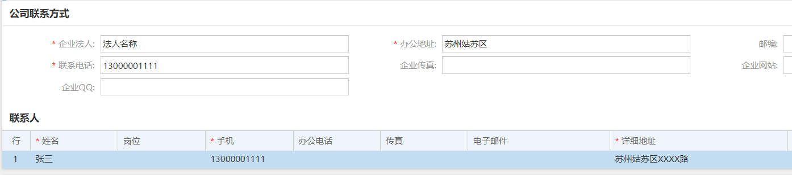
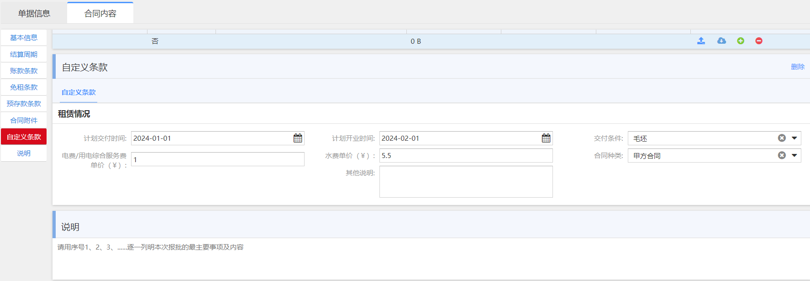

## 🏷️ 基础资料

___

### 商户

> 招商 >> 基础资料 >> 商户 >> 新建
> 
> 
> 
> 
> **输入必填信息后，点击保存，复制 `商户代码`，新建品牌时输入商户联系方式时使用**
> 
>

### 品牌

> 招商 >> 基础资料 >> 品牌 >> 新建
> 
> 
> 
> **输入必填信息后，点击保存**

### 场地和广告位

> 招商 >> 物业资源 >> 场地/广告位 >> 新建
> 
> 
> **输入必填信息后，点击保存**

## 🏷️ 新建租赁合同
___


> 招商 >> 租赁合同 >> 新合同申请 >> 新建 >> 固定租金加递增
> 
> 🔑`操作权限:项目招商企划人员`
> 
> 
> 
> **1. 填写基本信息**
> 
> 
> **2. 填写结算周期**
> 
> 
> 
```结算周期说明
功能说明
定义账款的结算方式，系统固化了某几类结算类型，定义某个或多个类型的账款类型多长时间结算一次，出账的日期为每月的哪一天。

关键字解释
周期类型：
合同月：以合同月为周期。
自然月：以自然月1号到月末为周期。
固定日：以本月的固定日作为结束日期，上月的固定日+1为周期的开始日期。

结算周期：
定义开单的日期，可定义1个月结算1次，也可以定义多个月结算1次，也可以定义1个月结算多次。

遇节假日提前：
最后缴款期若是节假日则最后缴款期提前到之前最近的一个工作日。

其他说明
只有定义结算周期后，对应的账款类型的科目费用才能在账单中体现出来
```
> **3. 填写账款条款**
> 
> 
```账款条款说明
功能说明
根据每日的面积单价计算每月的应收金额。

关键字解释
含税：
定义设置的单价及月金额是含税还是去税，最终进入账单的费用都是含税金额。

单价：
录入日面积单价，根据合同的计租面积以及月天数计算出月金额。

月金额：
每月应收金额，根据单价、计租面积以及月天数计算得出，也可以直接录入月金额，且能自动计算单价。

递增率：
可以设置递增率计算下一阶段的单价及月金额。

账款明细：
显示每个月应收金额，单个月份可以进行修改。
```

> **4. 填写免租条款，根据合同约定编辑或删除免租条款**
> 
>
> 
```免租条款说明
功能说明
用于定义某段时间内合同费用科目的免租比例，主要录入合同前期商场给商户的免租条款。

关键字解释
科目：
定义免租的科目。

免租比例：
定义科目的费用免租比例，如定义物业管理费在第一年免租80%，最终账单的时候体现免租的金额。
```

> **5. 填写预存款条款，根据合同约定录入预存款科目和金额**
> 
> 
> 

```预存款条款说明
功能说明
用于录入合同中约定的预收（存）款及保证金的金额，合同审核后，可以到财务的预存款中做实收。

关键字解释
科目：
限制选择科目类型为预存款、保证金的科目。

面积单价/系数：（仅用于商户、租户合同）
可按面积单价及系数定义应缴的预存款金额。

金额：
应缴的预存款金额。
金额=面积单价*系数*计租面积（仅用于商户、租户合同）
```

> **6. 上传合同附件**
> 
> 
> 
> **7. 填写自定义条款与说明，录入计划交铺和开业日期，水电费单价等信息**
> 
> 
> 
> **8. 录入所有必填内容后，点击`保存`**
> 
> **9. 复制 `新合同单号`
> 登陆[OA系统](http://oa.calxon-group.com/)，新建 [JKCHD001_新合同商务条款及合同审批流程](http://oa.calxon-group.com/spa/workflow/static4form/index.html?_rdm=1706605660325#/main/workflow/req?iscreate=1&workflowid=528&isagent=0&beagenter=0&f_weaver_belongto_userid=&f_weaver_belongto_usertype=0&menuIds=1,12&menuPathIds=1,12&_key=8ev4ih),输入上面复制的 `新合同单号`**
> 
> 
> 
> **10. 点击海鼎新合同页面右上角 `查阅商务条款` ，复制`商务条款`和`物管条款`至`OA系统表单`对应栏目**
> 
> 
> 
> **11. 填写`呈批内容`,上传必要附件资料，点击`提交`**
> 
> 
> 
> **12. 等待流程流转，上传乙方用印文件，待流程结束，快递乙方用印原件至招商中心进行我方用印并生效海鼎合同**


## 🏷️ 新建多经合同

___

> 招商 >> 场地合同 >> 新合同申请 >> 新建 >> 场地合同  
> 
> 🔑 `权限: 项目招商人员`
> 
> **1.填写基本信息**
> 
> 
> 
> **2.填写结算周期**
> 
> 
> 
> **3.填写账款条款，场地合同删除广告位租金条款，广告位合同删除场地租金条款**
> 
> 
> 
> 
> **4.填写预存款**
> 
> 
> 
> **5.上传附件，填写自定义条款**
> 
> 
> 
> **6.点击保存，并点击右上角 `查阅商务条款` 检查与合同是否一致**
> 
> 
> 
> **7.复制 `新场地合同申请单`
> 登陆[OA系统](http://oa.calxon-group.com/)，新建 [JKCHD003_多经合同条款审核及用印流程](http://oa.calxon-group.com/spa/workflow/static4form/index.html?_rdm=1706673634608#/main/workflow/req?iscreate=1&workflowid=471&isagent=0&beagenter=0&f_weaver_belongto_userid=&f_weaver_belongto_usertype=0&menuIds=1,12&menuPathIds=1,12&_key=03hvm7),输入上面复制的 `新场地合同申请单` 至OA表单 `多经合同申请单编号` 栏 ，等待查询合同信息，填写 `呈批内容` 和 `商务条款`，点击 `提交`**
> 
> 
> 
> **8.等待流程流转，上传乙方用印文件，待流程结束，快递乙方用印原件至招商中心进行我方用印并生效海鼎合同**


## 🏷️ 租赁合同变更

___

> 招商 >> 租赁合同 >> 合同 >> 操作
>
> 🔑 `权限:项目运营人员`
> 
> **1. 查询要变更的合同，点击打开，查看合同内容**
> 
> 
> 
> **2. 点击合同左上角 `操作`，选择要更变的单据类型**
> 
> 
>
```合同变更说明
   合同补充条款申请：可编辑合同各项字段，用于补充协议签署
   合同档案管理：只可以编辑合同附件，用于更新商户档案
   合同提前和推迟申请：用于更改合同开始日期
   合同延期和终止申请：用于更改合同结算日期
   作废：用于作废合同
   续约：用于续签合同
   复制：用于快速复制合同内容，新建类似条款合同
   上述变更，除合同档案管理不需要走OA审批，其余变更均需要进行OA审批
```  
> **3. 以合同补充条款申请举例**
> 
> 
> 
> 
> 
> **4. 修改完成之后，选择`保存`**
> 
> **5. 复制 `变更单号` ，打开[OA系统](http://oa.calxon-group.com/), 新建[JKCHD002_合同变更审批流程](http://oa.calxon-group.com/spa/workflow/static4form/index.html?_rdm=1706690485151#/main/workflow/req?iscreate=1&workflowid=86&isagent=0&beagenter=0&f_weaver_belongto_userid=&f_weaver_belongto_usertype=0&menuIds=1,12&menuPathIds=1,12&_key=xdxuqr), 输入`变更单号`，填写`呈批内容` 并上传`附件`，点击 `提交`**
>
> 
> 
> **6. 待OA流转结束，运营内勤检查变更单据无误，生效**
