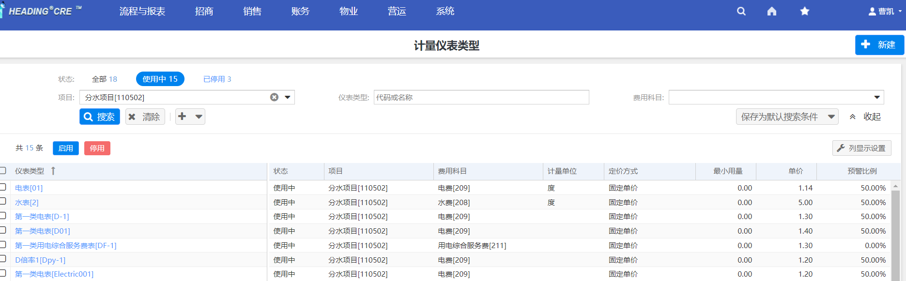
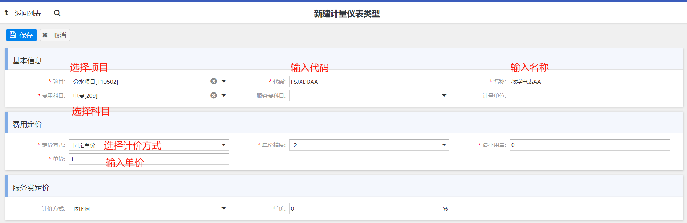
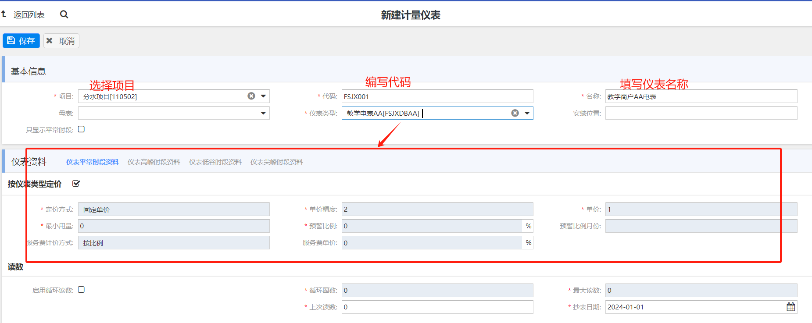
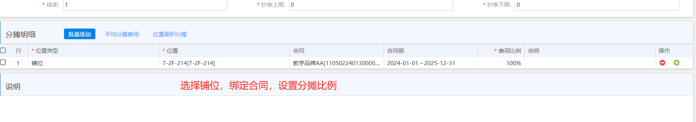
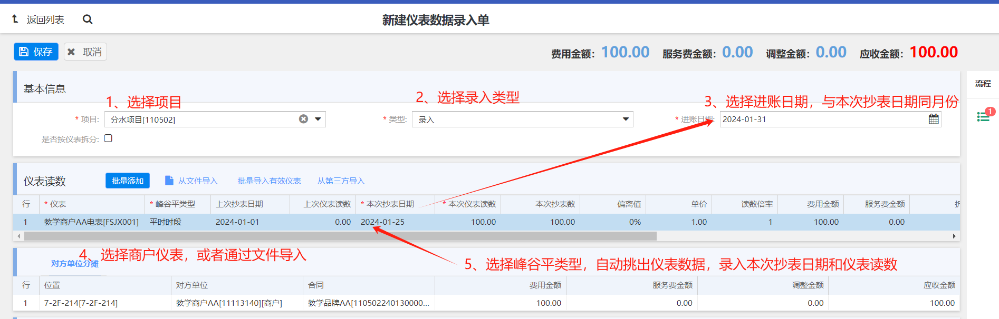
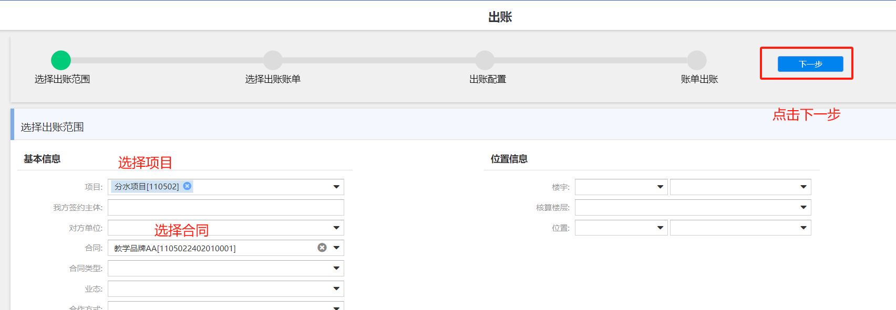
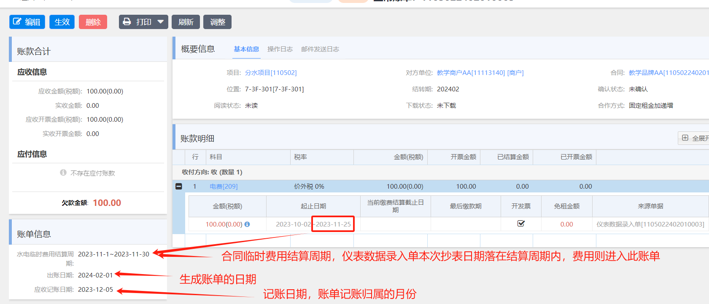
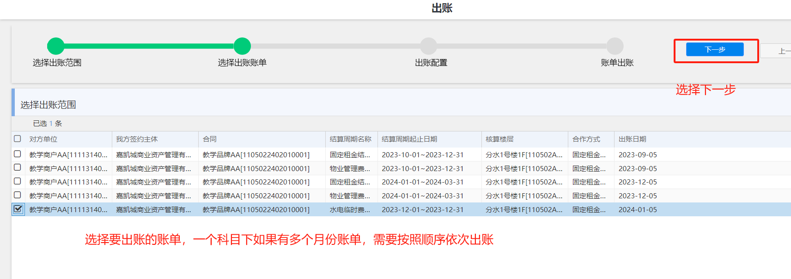
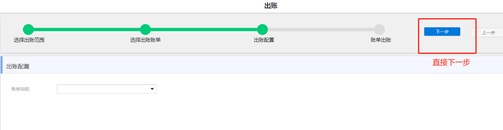
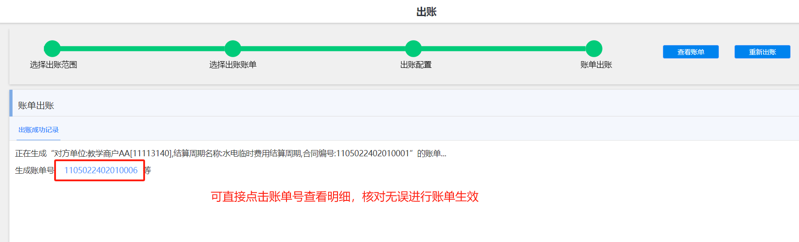

## ⏱️计量仪表类型

___

> 📝 物业 >> 水电煤 >> 计量仪表类型 >> 新建
> 
> 
> 
> 

## ⏱️计量仪表

___
> 
> 🔒 `前置条件：计量仪表类型` 
> 
> 🔒 `后置条件：仪表数据录入单`
> 
> 📝 操作菜单：物业 >> 水电煤 >> 计量仪表 >> 新建
> 
> 🔑 `权限：项目物业人员`
> 
> 
> 
> 
> 
> 
## ⏱️计量仪表录入单

___

> 🔒 `前置条件：计量仪表类型、计量仪表` 
>  
> 🔒 `后置条件：账单、收款单` 
> 
> 📝 操作菜单：物业 >> 水电煤 >> 计量仪表录入单 >> 新建
> 
> 
> 

## ⏱️水电账单和收款

___
> **临时费用一般出账方式为手动，需要进入模块：`账务 >> 财务应收 >> 出账` 进行手工出账**
> 
> 
> 
> 
> 
> 
> 
> 
> 
> 
> 
> **账单生效后的收款，详见 [收款单](http://localhost:3000/#/accounts?id=%f0%9f%8f%b7%ef%b8%8f-%e6%94%b6%e6%ac%be)**