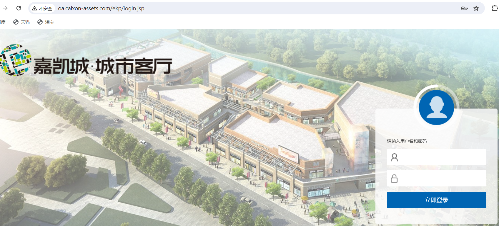
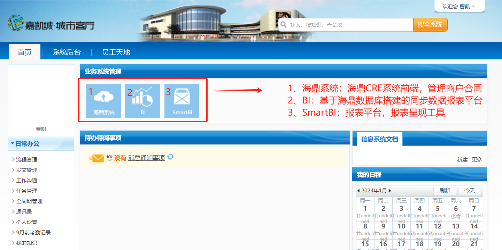
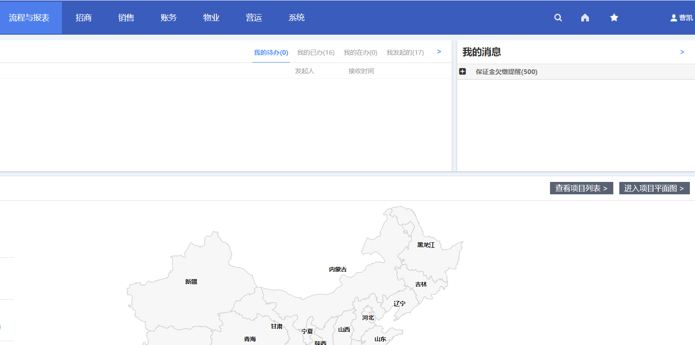

# 快速开始
___
## 🏷️ 登陆
[海鼎系统网址]( http://oa.calxon-assets.com/)
>推荐使用[`谷歌浏览器`](https://www.google.com/intl/zh-CN/chrome/) 

> 输入 `用户名` 和 `密码` ，点击 `立即登陆`


> 海鼎系统界面


## 🏷️ 模块概述
### 招商模块

```模块清单
基础资料:品牌|商户|铺位|场地|广告位
租赁合同:合同|新合同申请|变更申请
场地合同:合同|新合同申请|变更申请
广告位合同:合同|新合同申请|变更申请
招商规划:租金计划
```

### 销售模块

```模块清单
销售数据录入|历史销售数据补录|销售数据查询|客流数据录入|车流数据录入
```

### 账务模块

```模块清单
基础资料:科目|结算配置
收款:收款单|预存款单|预存款转移单
财务应收:出账|批量出账|账单|账单调整单|收付款通知单
```

### 物业模块

```模块清单
水电煤:计量仪表|计量仪表类型|仪表数据录入单
```